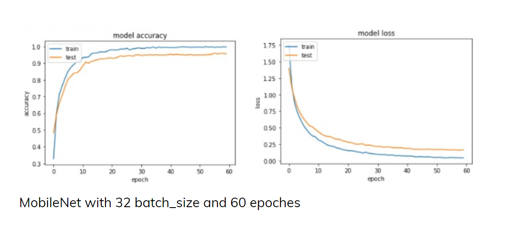
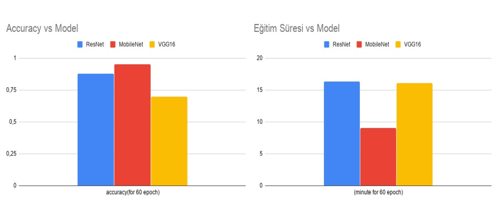

# Recycling Systems
Unfortunately, since recyclable materials cannot be recycled in the right way all over the world, they are valued in the trash class and make us lose a great deal of energy. At the same time, it also harms the production side and causes many global problems throughout the process. As for the detail of the project, as a team of 7 students including 2 mentors and 5 students, we had a total of 2527 data. In total, we had 6 different classes of 5 different recyclable materials and waste (which could be considered as household waste or other). Although we did not have enough data for this project, we obtained a study in which we can obtain good results for a small demo. We devoted 70% of all data to test 30% of training. We have recorded the most successful results by training our machine with the most accurate neural network models. We used the model that gave us the best results in the project. With the model we used, we achieved success rates up to 97% in our project.
Here are the models and results:

